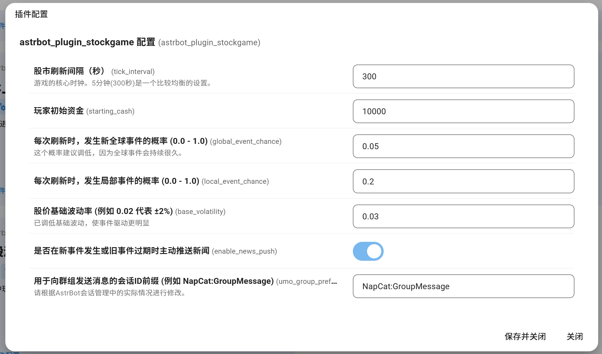

# Astrbot 插件：模拟炒股游戏 (stockgame)

一个基于 Astrbot 的模拟炒股游戏插件。

> ⭐ **使用此游戏请给作者一个Star，鼓励作者做出更多好玩的插件，给作者更新的动力！**

---

## 📖 插件功能

本插件提供了一个基础的模拟炒股功能，允许群成员进行虚拟交易。

**主要命令：**

| 命令                         | 说明                                   |
| ---------------------------- | -------------------------------------- |
| /炒股 菜单                   | 查看本菜单                             |
| /炒股 开启推送               | (群聊) 在本群开启股市新闻推送。        |
| /炒股 关闭推送               | (群聊) 在本群关闭股市新闻推送。        |
| /炒股 开户                   | 加入游戏，获取启动资金。               |
| /炒股 全球局势               | 查看当前影响市场的“全球事件”。         |
| /炒股 新闻                   | 查看最近一次发生的“突发事件”。         |
| /炒股 大盘                   | 查看所有股票的当前价格和全球局势。     |
| /炒股 详情 [股票代码]        | 查看单支股票的详细信息和历史价格曲线。 |
| /炒股 我的资产               | 查看你持有的现金和股票。               |
| /炒股 买入 [股票代码] [数量] | 示例: /炒股 买入 QLAI 10               |
| /炒股 卖出 [股票代码] [数量] | 示例: /炒股 卖出 QLAI 10               |
| /炒股 全部卖出               | 卖出你的所有类型股票                   |

---

## 🔧 插件配置

---

## ⚠️ 关于图片渲染的说明

* **关于“大盘”图片**
  * 为了确保所有信息都能显示完整，`炒股 大盘` 命令生成的图片默认开启了 `fullPage` 截图。
  * 这可能会导致生成的图片宽度过大（例如超过 800px），**可能并不美观**，请您见谅。
  * 作者自己通过修改文转图服务器使图片完美显示了，但是不修改服务器使图片缩小显示的方法并未成功，**期待有能之士提交PR**

* **关于“详情”图片字体**
  * `炒股 详情` 命令使用 `matplotlib` 绘图。为了正确显示中文，插件会优先加载本地 `resources/` 目录下的自带字体。
  * 如果加载失败，它会尝试使用您服务器上的系统字体（如 `WenQuanYi Zen Hei`, `Noto Sans CJK SC`, `SimHei` 等）。
  * 如果均失败，K线图中的中文将显示为方块。

---

## ❤️ 欢迎贡献

作者目前已完成了基础功能。

如果您对这个游戏有更多的想法（例如更完善的经济模型、更美观的图片模板），**作者非常欢迎有能力的用户可以进行修改和完善这个游戏，并欢迎你们提交 PR！**